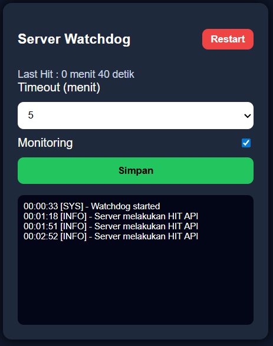

# 🔌 ESP8266 Server Watchdog (Relay + Web UI)

Project ini adalah **watchdog berbasis ESP8266 (Wemos D1 Mini)** untuk memonitor server melalui mekanisme **HIT API**.  
Jika server tidak melakukan HIT dalam waktu tertentu, ESP8266 akan **men-trigger relay untuk me-restart server otomatis**.

Watchdog ini juga dilengkapi **Web UI elegan** untuk mengatur timeout, enable/disable monitoring, melihat log, dan restart manual.

---

## ✨ Fitur

- ✅ Monitoring server via HTTP HIT  
- ✅ Timeout berbasis menit  
- ✅ Auto restart server via relay  
- ✅ Web UI sederhana & mobile friendly  
- ✅ Simpan konfigurasi di EEPROM  
- ✅ Log aktivitas realtime  
- ✅ Tombol restart manual  

---

## 🧠 Cara Kerja

1. Server memanggil endpoint `/hit` secara berkala (misal tiap 1 menit).
2. ESP8266 mencatat waktu terakhir HIT.
3. Jika melebihi `timeoutMinutes`:
   - Relay aktif selama 3 detik.
   - Server dianggap direstart.
4. Semua aktivitas dicatat di log web.

Singkatnya:  
**Server diam → timeout → relay ON → server restart 😎**

---

## ⚙️ Konfigurasi WiFi & IP

Edit bagian ini di kode:

```cpp
const char* ssid = "AP DEPAN";
const char* password = "rotibakar";

IPAddress local_IP(192,168,5,16);
IPAddress gateway(192,168,5,1);
IPAddress subnet(255,255,255,0);
IPAddress dns1(1,1,1,1);
IPAddress dns2(1,0,0,1);
```

---

## 🔌 Wiring

| ESP8266 | Device |
|--------|--------|
| D1     | Relay IN |
| GND    | Relay GND |
| 5V/3V3 | Relay VCC |

> Pastikan relay compatible dengan tegangan Wemos.

---

## 🌐 Web Interface

Akses lewat browser:

```
http://IP_WEMOS/
```

Contoh:

```
http://192.168.5.16/
```

Di web kamu bisa:

- Set timeout (menit)
- Enable / Disable monitoring
- Lihat last hit
- Lihat log
- Restart manual server

---

## 🖼️ Tampilan Web UI




## 🔗 Endpoint API

| Endpoint | Fungsi |
|---------|--------|
| `/` | Web UI |
| `/hit` | Server HIT API |
| `/save` | Simpan konfigurasi |
| `/status` | Status last hit |
| `/logs` | Ambil log |
| `/restart` | Restart manual |

---

## 🖥️ Contoh HIT dari Server

Linux cron contoh:

```bash
curl http://192.168.5.16/hit
```

Atau di Python:

```python
import requests
requests.get("http://192.168.5.16/hit")
```

---

## 🧪 Contoh Output Log (Web)

```text
00:00:01 [SYS] - Watchdog started
00:01:00 [INFO] - Server melakukan HIT API
00:02:00 [INFO] - Server melakukan HIT API
00:05:10 [WARN] - Timeout, relay restart
00:05:12 [MANUAL] - Restart via Web
```

---

## 💾 Penyimpanan

Konfigurasi disimpan di EEPROM:

- Timeout
- Monitoring ON/OFF

Aman walau ESP restart.
