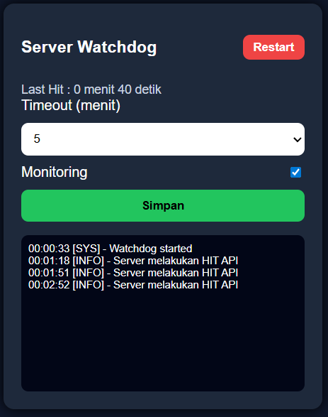

# 🔌 ESP8266 Server Watchdog (Relay + Web UI)

Project ini adalah **watchdog berbasis ESP8266 (Wemos D1 Mini)** untuk memonitor server melalui mekanisme **HIT API**.  
Jika server tidak melakukan HIT dalam waktu tertentu, ESP8266 akan **men-trigger relay untuk me-restart server otomatis**.

Watchdog ini dilengkapi **Web UI elegan** untuk mengatur timeout, enable/disable monitoring, melihat log, restart manual, dan konfigurasi WiFi — semua tanpa perlu USB.

---

## ✨ Fitur

- ✅ Monitoring server via HTTP HIT  
- ✅ Timeout berbasis menit  
- ✅ Auto restart server via relay  
- ✅ Web UI sederhana & mobile friendly  
- ✅ Simpan konfigurasi di EEPROM  
- ✅ Log aktivitas realtime  
- ✅ Tombol restart manual  
- ✅ **OTA (Over-The-Air)** — upload sketch via Arduino IDE lewat WiFi, tanpa kabel USB  
- ✅ **WiFi Fallback Hotspot** — jika SSID tidak ditemukan dalam 30 detik, Wemos otomatis buka hotspot untuk setting WiFi baru via browser  
- ✅ **Ganti WiFi dari Dashboard** — ubah SSID/password langsung dari Web UI tanpa buka Arduino IDE  

---

## 🧠 Cara Kerja

1. Server memanggil endpoint `/hit` secara berkala (misal tiap 1 menit).
2. ESP8266 mencatat waktu terakhir HIT.
3. Jika melebihi `timeoutMinutes`:
   - Relay aktif selama 3 detik.
   - Server dianggap direstart.
4. Semua aktivitas dicatat di log web.

Singkatnya:  
**Server diam → timeout → relay ON → server restart 😎**

---

## 📡 OTA (Over-The-Air Update)

Fitur OTA memungkinkan upload sketch baru **langsung dari Arduino IDE lewat jaringan WiFi**, tanpa perlu kabel USB.

### Cara Upload via OTA

1. Pastikan Wemos sudah konek ke WiFi dan sudah di-flash sekali via USB dengan kode terbaru ini.
2. Buka Arduino IDE.
3. Pilih **Tools → Port**, pilih port yang namanya:
   ```
   watchdog-wemos at 192.168.0.16
   ```
   *(muncul otomatis saat Wemos online di jaringan yang sama)*
4. Klik **Upload** seperti biasa.

> **Catatan:** Komputer dan Wemos harus berada di jaringan WiFi yang **sama**.

### Password OTA (Opsional)

Untuk mengaktifkan password OTA, uncomment baris ini di kode:

```cpp
ArduinoOTA.setPassword("admin123");
```

Lalu set password di Arduino IDE: **Tools → Upload Password**.

---

## 📶 WiFi Fallback Hotspot

Jika Wemos **tidak berhasil konek ke WiFi dalam 30 detik**, ia akan otomatis masuk ke **mode hotspot (AP)**.

### Cara Setting WiFi Baru

1. Cari WiFi baru di HP/laptop dengan nama:
   ```
   Watchdog-Setup
   ```
   *(open network, tanpa password)*

2. Hubungkan ke hotspot tersebut.

3. Buka browser, akses:
   ```
   http://192.168.4.1
   ```

4. Masukkan **SSID** dan **Password** WiFi yang baru, lalu klik **Simpan & Restart**.

5. Wemos akan restart dan mencoba konek ke WiFi baru. Kredensial disimpan di EEPROM sehingga **tidak hilang saat restart**.

### Ganti WiFi dari Dashboard (Mode Normal)

Jika Wemos sudah online, kamu juga bisa ganti WiFi langsung dari Web UI:

1. Buka `http://192.168.0.16/`
2. Scroll ke bagian **🌐 Ganti Konfigurasi WiFi**
3. Masukkan SSID dan password baru, klik **Simpan WiFi & Restart**

---

## ⚙️ Konfigurasi WiFi & IP Default

Edit nilai default di kode (dipakai saat EEPROM masih kosong / pertama kali flash):

```cpp
char wifiSSID[33]     = "AP RUMAH";
char wifiPassword[65] = "rotibakar";

IPAddress local_IP(192, 168, 0, 16);
IPAddress gateway(192, 168, 0, 1);
IPAddress subnet(255, 255, 255, 0);
```

---

## 💾 Penyimpanan EEPROM

| Alamat | Isi | Ukuran |
|--------|-----|--------|
| 0      | Timeout (menit) | 4 byte |
| 10     | Monitoring ON/OFF | 1 byte |
| 20     | WiFi SSID | 33 byte |
| 54     | WiFi Password | 65 byte |
| 120    | Flag kredensial (0xAB) | 1 byte |

Semua konfigurasi **aman walau ESP restart**.

---

## 🔌 Wiring

| ESP8266 | Device |
|--------|--------|
| D1     | Relay IN |
| GND    | Relay GND |
| 5V/3V3 | Relay VCC |

> Pastikan relay compatible dengan tegangan Wemos.

---

## 🌐 Web Interface

### Mode Normal

Akses lewat browser:

```
http://192.168.0.16/
```

Di web kamu bisa:

- Set timeout (menit)
- Enable / Disable monitoring
- Lihat last hit
- Lihat log
- Restart manual server
- Ganti konfigurasi WiFi

### Mode Hotspot (AP)

Akses lewat browser setelah konek ke WiFi `Watchdog-Setup`:

```
http://192.168.4.1/
```

---

## 🖼️ Tampilan Web UI



---

## 🔗 Endpoint API

| Endpoint | Fungsi |
|---------|--------|
| `/` | Web UI |
| `/hit` | Server HIT API |
| `/save` | Simpan konfigurasi timeout & monitoring |
| `/status` | Status last hit (JSON) |
| `/logs` | Ambil log (JSON) |
| `/restart` | Restart manual server via relay |
| `/setwifi` | Simpan kredensial WiFi baru & restart |

---

## 🖥️ Contoh HIT dari Server

Linux cron:

```bash
curl http://192.168.0.16/hit
```

Python:

```python
import requests
requests.get("http://192.168.0.16/hit")
```

---

## 🧪 Contoh Output Log (Web)

```text
00:00:01 [SYS] - Watchdog started
00:00:02 [SYS] - WiFi OK: 192.168.0.16
00:01:00 [INFO] - Server melakukan HIT API
00:02:00 [INFO] - Server melakukan HIT API
00:05:10 [WARN] - Timeout, relay restart
00:05:12 [MANUAL] - Restart via Web
00:10:00 [OTA] - Upload sketch dimulai
00:10:15 [OTA] - Upload selesai, restart...
```

---

## 📦 Library yang Dibutuhkan

Install via Arduino Library Manager atau Board Manager:

| Library | Sumber |
|--------|--------|
| `ESP8266WiFi` | Bawaan ESP8266 Board Package |
| `ESP8266WebServer` | Bawaan ESP8266 Board Package |
| `EEPROM` | Bawaan ESP8266 Board Package |
| `ArduinoOTA` | Bawaan ESP8266 Board Package |

> Pastikan sudah install **ESP8266 Board** di Arduino IDE:  
> `File → Preferences → Additional Board Manager URLs`:  
> `http://arduino.esp8266.com/stable/package_esp8266com_index.json`


---

## ✨ Fitur

- ✅ Monitoring server via HTTP HIT  
- ✅ Timeout berbasis menit  
- ✅ Auto restart server via relay  
- ✅ Web UI sederhana & mobile friendly  
- ✅ Simpan konfigurasi di EEPROM  
- ✅ Log aktivitas realtime  
- ✅ Tombol restart manual  

---

## 🧠 Cara Kerja

1. Server memanggil endpoint `/hit` secara berkala (misal tiap 1 menit).
2. ESP8266 mencatat waktu terakhir HIT.
3. Jika melebihi `timeoutMinutes`:
   - Relay aktif selama 3 detik.
   - Server dianggap direstart.
4. Semua aktivitas dicatat di log web.

Singkatnya:  
**Server diam → timeout → relay ON → server restart 😎**

---

## ⚙️ Konfigurasi WiFi & IP

Edit bagian ini di kode:

```cpp
const char* ssid = "AP DEPAN";
const char* password = "rotibakar";

IPAddress local_IP(192,168,5,16);
IPAddress gateway(192,168,5,1);
IPAddress subnet(255,255,255,0);
IPAddress dns1(1,1,1,1);
IPAddress dns2(1,0,0,1);
```

---

## 🔌 Wiring

| ESP8266 | Device |
|--------|--------|
| D1     | Relay IN |
| GND    | Relay GND |
| 5V/3V3 | Relay VCC |

> Pastikan relay compatible dengan tegangan Wemos.

---

## 🌐 Web Interface

Akses lewat browser:

```
http://IP_WEMOS/
```

Contoh:

```
http://192.168.0.16/
```

Di web kamu bisa:

- Set timeout (menit)
- Enable / Disable monitoring
- Lihat last hit
- Lihat log
- Restart manual server

---

## 🖼️ Tampilan Web UI


## 🔗 Endpoint API

| Endpoint | Fungsi |
|---------|--------|
| `/` | Web UI |
| `/hit` | Server HIT API |
| `/save` | Simpan konfigurasi |
| `/status` | Status last hit |
| `/logs` | Ambil log |
| `/restart` | Restart manual |

---

## 🖥️ Contoh HIT dari Server

Linux cron contoh:

```bash
curl http://192.168.0.16/hit
```

Atau di Python:

```python
import requests
requests.get("http://192.168.0.16/hit")
```

---

## 🧪 Contoh Output Log (Web)

```text
00:00:01 [SYS] - Watchdog started
00:01:00 [INFO] - Server melakukan HIT API
00:02:00 [INFO] - Server melakukan HIT API
00:05:10 [WARN] - Timeout, relay restart
00:05:12 [MANUAL] - Restart via Web
```

---

## 💾 Penyimpanan

Konfigurasi disimpan di EEPROM:

- Timeout
- Monitoring ON/OFF

Aman walau ESP restart.
